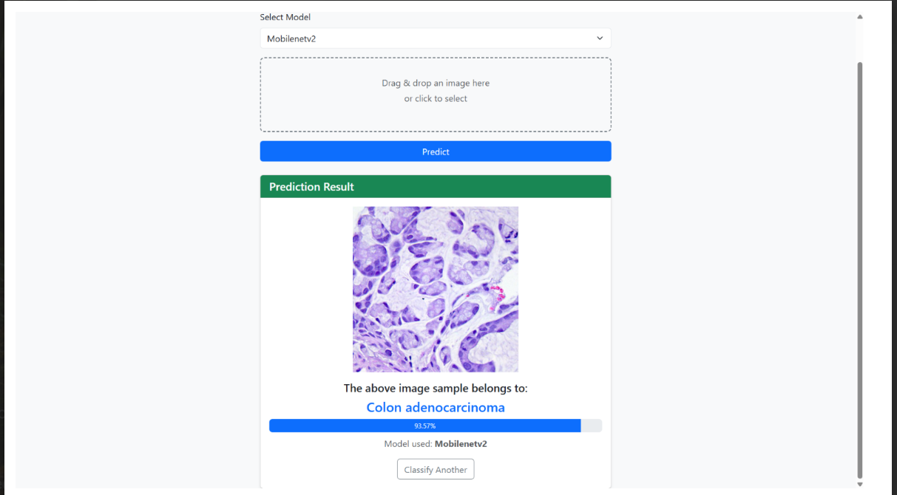

- Built an **end-to-end deep learning framework** for automated detection of **colon and lung cancer** using histopathological images (LC25000 dataset).
- Implemented and compared **MobileNetV2, DenseNet121, and AlexNet**, achieving a **peak accuracy of 98.64%** with MobileNetV2.
- Developed a **Flask-based web application** enabling real-time image upload, model selection, and cancer prediction with **confidence scores**, making the system practical for clinical and research use.

### Screenshot

